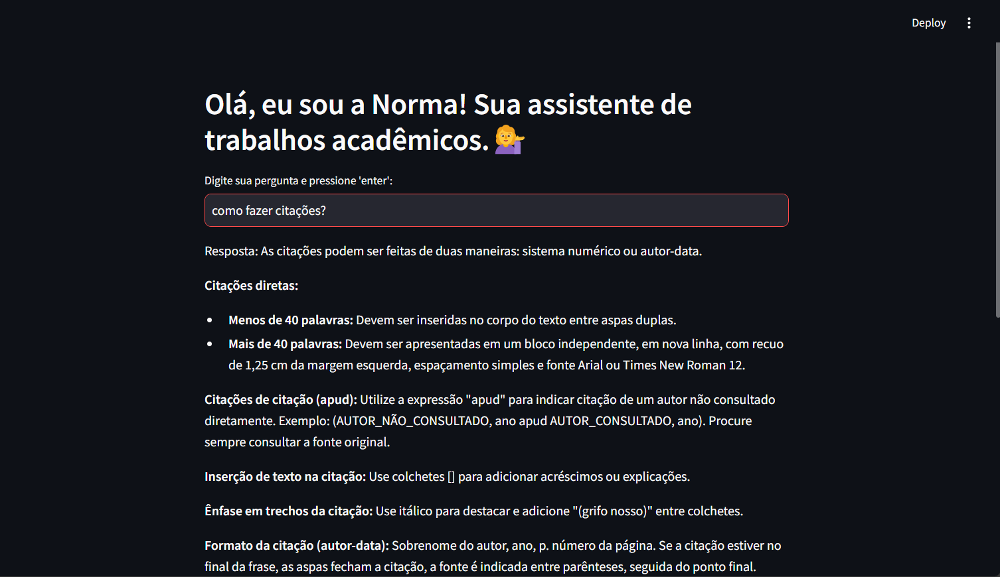

# ChatPDF Acadêmico - Norma

**Norma** é um chatbot baseado em inteligência artificial desenvolvido para responder perguntas sobre normas de trabalhos acadêmicos. Este projeto utiliza tecnologias avançadas como **Google Generative AI**, **LangChain** e **Streamlit** para facilitar o entendimento de normas acadêmicas por meio de PDFs enviados pelos usuários.

## 🖼️ Tela




## 🔧 Funcionalidades

- **Carregamento de PDFs**: O usuário pode carregar arquivos contendo normas acadêmicas.
- **Extração de Texto**: Utiliza `pdfplumber` para extrair o texto dos arquivos PDF.
- **Vetorização de Documentos**: Implementa embeddings para indexar e consultar documentos de forma eficiente.
- **Busca Semântica**: Retorna documentos relevantes usando similaridade de cosseno.
- **Respostas Contextuais**: Gera respostas utilizando o modelo **Gemini-1.5-flash** da Google.
- **Avaliação de Respostas**: Compara a similaridade entre respostas geradas e esperadas.

## 🚀 Como Funciona

1. **Carregamento de PDFs**: 
   O usuário carrega os arquivos na interface Streamlit.
   
2. **Processamento dos Arquivos**:
   - Texto é extraído e dividido em pedaços (parágrafos).
   - Cada pedaço é vetorizado usando embeddings.
   - Os vetores são armazenados em um banco de dados PostgreSQL com suporte à extensão `pgvector`.

3. **Consulta e Resposta**:
   - O usuário faz perguntas relacionadas aos PDFs carregados.
   - O sistema busca documentos relevantes e utiliza um modelo de linguagem para gerar uma resposta contextual.

4. **Avaliação**:
   - Calcula a similaridade entre a resposta gerada e a esperada.
   - Classifica o desempenho como **Alta**, **Moderada** ou **Baixa** similaridade.

## 🛠️ Tecnologias Utilizadas

- **Streamlit**: Interface interativa para usuários.
- **LangChain**: Orquestração de tarefas de IA e embeddings.
- **Google Generative AI**: Para embeddings e geração de respostas.
- **PostgreSQL + pgvector**: Armazenamento e busca de vetores.
- **pdfplumber**: Extração de texto de PDFs.
- **scikit-learn**: Similaridade de cosseno.
- **dotenv**: Gerenciamento de variáveis de ambiente.

## 📦 Instalação

### Pré-requisitos

- Python 3.9+
- Banco de Dados PostgreSQL com extensão `pgvector`.

### Passos

1. Clone o repositório:
   ```bash
   git clone https://github.com/seu-usuario/chatpdf-academico.git
   cd chatpdf-academico
   ```

2. Crie um ambiente virtual e ative-o:
   ```bash
   python -m venv venv
   source venv/bin/activate  # Linux/Mac
   venv\Scripts\activate     # Windows
   ```

3. Instale as dependências:
   ```bash
   pip install -r requirements.txt
   ```

4. Configure variáveis de ambiente no arquivo `.env`:
   ```
   GOOGLE_API_KEY=your-google-api-key
   DB_NAME=your-db-name
   DB_USER=your-db-user
   DB_PASSWORD=your-db-password
   DB_HOST=your-db-host
   DB_PORT=your-db-port
   ```

5. Execute o aplicativo:
   ```bash
   streamlit run RAG_gemini-Ref_CosineSimilarity.py
   ```

## 📂 Estrutura do Projeto

- `RAG_gemini-Ref_CosineSimilarity.py`: Código principal do projeto.
- `requirements.txt`: Dependências necessárias.
- `.env`: Variáveis de ambiente (não incluído, deve ser criado pelo usuário).

## 📝 Licença

Este projeto está licenciado sob a licença MIT. Consulte o arquivo LICENSE para mais detalhes.
